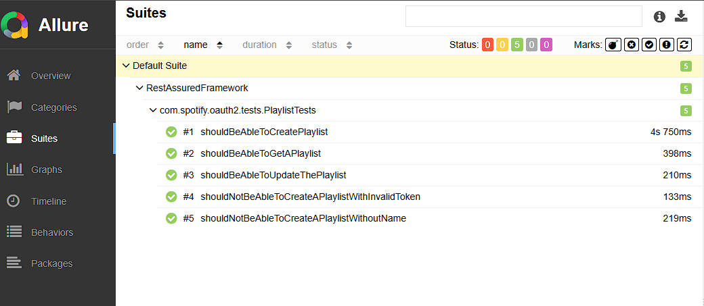

# Tools and Technologies
- Rest Assured
- TestNG
- Java
- Allure Reports
- Hamcrest
- Jackson API
- Lombok

# Framework Goals
- Scalabale and extensible
- Reusable Rest Assured specifications
- Resuable Rest Assured API requests
- Separation of API layer from test layer
- POJOs for serialization and deserialization
- Singleton Design Pattern
- Lombok for reducing Boilerplate code
- Builder pattern for setter methods in POJOs
- Reporting and logging using Allure
- Automate positive and negative scenarios
- Support parallel execution
- Data driven using TestNG Data Provider
- Automated access token renewal
- Maven command line execution
- Integration with Git
- Integration with Jenkins

# Framework Project Structure

# Allure Reports 

